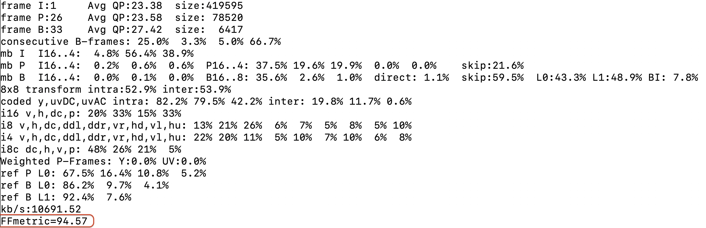

# FFmetric

FFmetric is an open-source perceptual video quality prediction framework integrated into FFmpeg.

It provides lightweight, decoding-free perceptual quality estimation using encoder-side compression statistics. FFmetric can be used for real-time quality monitoring, adaptive encoding, bitrate ladder generation, and large-scale transcoding without requiring decoded frames or reference videos.

## Overview

FFmetric is implemented as a standalone module for FFmpeg's `libavcodec`:

```text
ffmetric.c
ffmetric.h
ffmetric_xgb_model.h
```

Only minimal hooks are added to FFmpeg's `libavcodec/libx264.c`. These hooks allow FFmetric to collect x264 encoder statistics and print a predicted quality score at the end of encoding.

## Requirements

Before installing FFmetric, make sure you have:

- FFmpeg source code
- libx264 development files
- Standard FFmpeg build tools
- Python 3 (used by `install.sh` for safe text patching)

`install.sh` is self-contained and performs all patching directly.

## Installation

First, clone FFmpeg if you do not already have it:

```sh
git clone https://git.ffmpeg.org/ffmpeg.git ffmpeg
```

Then clone FFmetric:

```sh
git clone https://github.com/HadiAmirpour/FFmetric.git
```

Move into the FFmetric directory:

```sh
cd FFmetric
```

On macOS/Linux, you can make the installer executable:

```sh
chmod +x install.sh
```

Then run the installer:

```sh
./install.sh /path/to/ffmpeg
```

Alternatively, you can run the installer directly with Bash without using `chmod`:

```sh
bash install.sh /path/to/ffmpeg
```

For example, if `FFmetric` and `ffmpeg` are in the same parent directory:

```sh
./install.sh ../ffmpeg
```

or:

```sh
bash install.sh ../ffmpeg
```

The installer copies the FFmetric files into:

```text
ffmpeg/libavcodec/
```

and patches:

```text
ffmpeg/libavcodec/libx264.c
ffmpeg/libavcodec/Makefile
```

Before modifying FFmpeg files, the installer creates backups of:

```text
libavcodec/libx264.c
libavcodec/Makefile
```

The installer keeps only the most recent backup for each file (older backup files are removed automatically).

After each run, the installer prints exact restore commands. You can also restore manually with:

```sh
cp "/path/to/ffmpeg/libavcodec/libx264.c.bak.<timestamp>" "/path/to/ffmpeg/libavcodec/libx264.c"
cp "/path/to/ffmpeg/libavcodec/Makefile.bak.<timestamp>" "/path/to/ffmpeg/libavcodec/Makefile"
```

## Build FFmpeg

After installing FFmetric, configure and build FFmpeg with libx264 enabled:

```sh
cd /path/to/ffmpeg
./configure --enable-libx264 --enable-gpl
make -j
```

Depending on your system, you may need to add your usual FFmpeg configuration options.

## Usage

Enable FFmetric during libx264 encoding with:

```sh
-ffmetric 1
```

Example:

```sh
./ffmpeg -loglevel info -i input.mp4 -c:v libx264 -crf 28 -ffmetric 1 output.mp4
```

At the end of encoding, FFmetric prints a predicted quality score:

```text
FFmetric: 94.57
```

## How It Works

When `-ffmetric 1` is enabled, FFmetric collects final x264 encoder statistics through the x264 logging callback.

The collected statistics include:

- I/P/B frame counts
- Average QP values
- Frame sizes
- Consecutive B-frame statistics
- Macroblock mode statistics
- Transform statistics
- Coded block statistics
- Reference frame statistics
- Output bitrate

These values are converted into a feature vector and passed to the embedded XGBoost model in:

```text
ffmetric_xgb_model.h
```

The final prediction is printed after:

```c
x264_encoder_close(x4->enc);
```

because x264 emits its final encoding statistics during encoder closing.

## Repository Structure

```text
FFmetric/
├── ffmetric.c
├── ffmetric.h
├── ffmetric_xgb_model.h
├── install.sh
├── images/
│   └── example.jpg
└── README.md
```

## Files

| File | Description |
|---|---|
| `ffmetric.c` | FFmetric feature parsing and prediction logic |
| `ffmetric.h` | FFmetric context structure and public function declarations |
| `ffmetric_xgb_model.h` | Embedded XGBoost prediction model |
| `install.sh` | Installer that copies FFmetric files and patches FFmpeg/libx264 |
| `images/example.jpg` | Example output image |

## Notes

- FFmetric currently works with FFmpeg's `libx264` encoder.
- The FFmetric output is printed only when `-ffmetric 1` is used.
- Use `-loglevel info` or a more verbose FFmpeg log level to see the printed prediction.
- `chmod +x install.sh` is needed only if you want to run the installer directly as `./install.sh`.
- You can avoid `chmod` by running the installer with `bash install.sh /path/to/ffmpeg`.
- If installation fails, check the timestamped backup files created by `install.sh`.

## Troubleshooting

- If `install.sh` says Python 3 is missing, install Python 3 and rerun.
- If patching fails on a custom FFmpeg fork, restore backups and inspect local changes in `libavcodec/libx264.c` and `libavcodec/Makefile`.
- If FFmetric output does not appear, confirm you encoded with `-ffmetric 1` and used `-loglevel info` (or higher verbosity).

## Example Output

